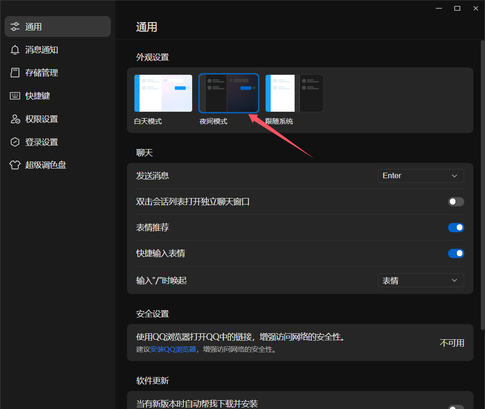

# sdu-volunteer-survey
山东大学软件学院志愿报名脚本

## 需求

我们学院的志愿服务名额方式确定是这样的：

学生会的志实部门拉一个大群（禁言），平时会发布若干志愿服务的招募信息，并指定一个精确的时间发布问卷网的问卷，对该志愿感兴趣的同学需要在其发布后填写，通常名额有限，先到先得。

但是，鼠鼠打字极慢，根本抢不到，好几次都要红温了；

因此，就有了这个项目，用来监听我屏幕上显示的QQ群，一旦有新消息：

1. 脚本就会通过图像算法定位新消息在屏幕上的位置
2. 模拟键鼠输入，点击、全选、复制、提取该消息框的消息
3. 从消息中提取问卷网的网址
4. 使用`selenium`自动填写预设的答案并提交

## 使用方法

修改`main.py`的内容，见注释：

```python
# 预设答案
answer = {
  '姓名': 'xxx',
  '学号': '202100300xxx',
  '电话': '15812345678',
  '手机': '15812345678',
  '联系方式': '15812345678',
  '班级': 'xxxx21.x',
  '性别': '男',
}

# 指定屏幕监听区域，不清楚可以使用qq截图工具看一下
# 左上角坐标
x1 = 10
y1 = 50
# 右下角坐标
x2 = 1690
y2 = 780

# 监听屏幕轮询的时间间隔（秒）
interval = 2

# 监听的持续时间（秒）
duration = 180

# 同一个问卷链接的提交次数
submit_times = 1

# 从运行到开始监听的等待时间（秒）
wait_time = 5

# 启动程序
time.sleep(wait_time)
watchqq.launch(answer=answer, x1=x1, y1=y1, x2=x2, y2=y2, interval=interval, duration=duration, submit_times=submit_times)

```

运行后，确保QQ群在屏幕最上方，请确保使用**夜间模式**

